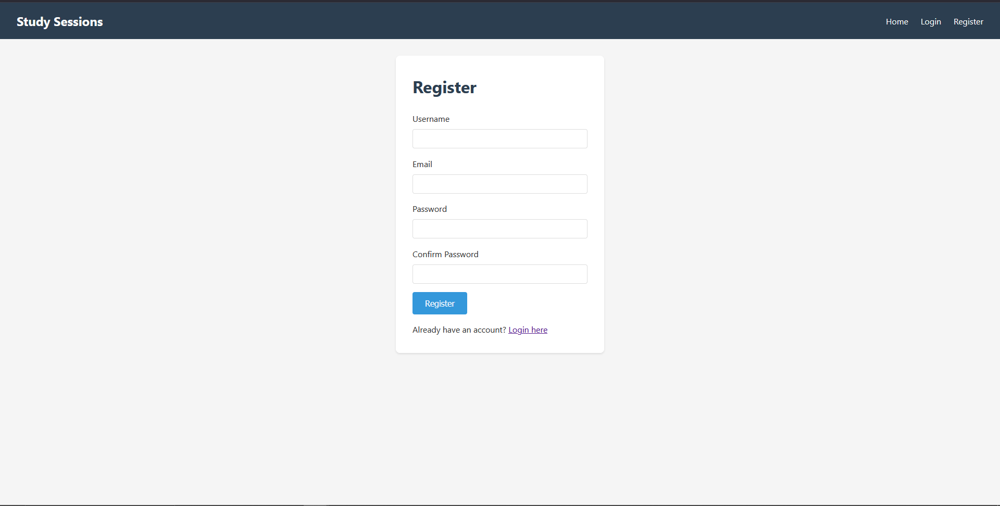
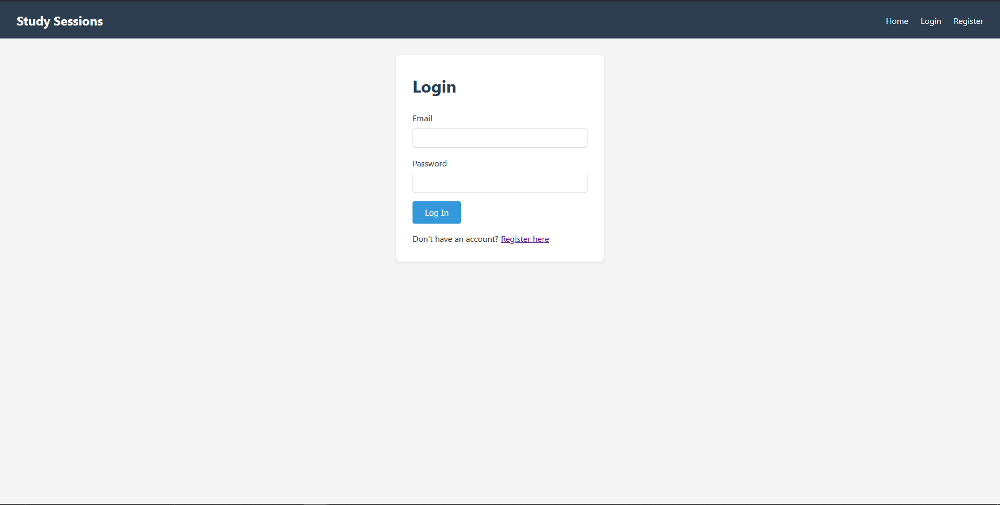
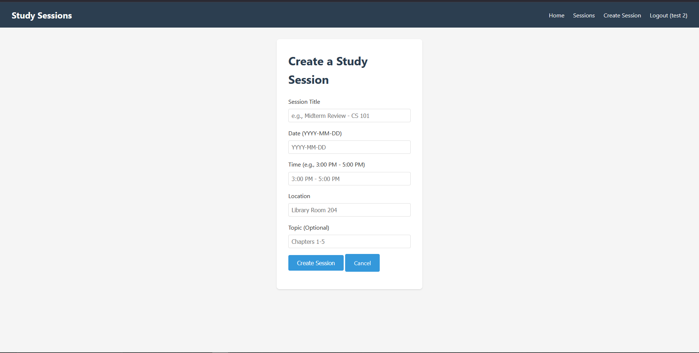
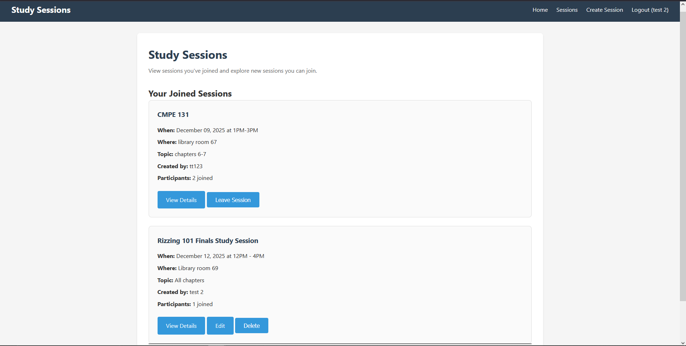

# Studysession

A course-integrated study session coordination platform where students can create and join study sessions with classmates.

- Google Doc M1: [Link](https://docs.google.com/document/d/1iHBsqym4T0VoHqEuDuFzItrlC4IJMhldQqj5BU9CPhY/edit?usp=sharing)
- Google Doc M2: [Link](https://docs.google.com/document/d/1KkmVYkP5u-_XDMYnVV7Wmhy7TZEdqt3Dd5rEI2x9ZnY/edit?usp=sharing)
- Google Doc M3: [Link](https://docs.google.com/document/d/1_rsvlZvJEEP-TuWiA2gKWB6IrEKPiYIiJsKl71iikZU/edit?usp=sharing)

## M2 Features Implemented

### Core CRUD Operations ✅
- **Create**: Users can create study sessions with title, date, time, location, and optional topic
- **Read**: Users can view all sessions (separated into joined vs available sessions)
- **Update**: Session creators can edit their session details
- **Delete**: Session creators can delete their sessions

### User Authentication ✅
- Complete registration with username, email, and password
- Login/logout functionality with Flask-Login
- Protected routes requiring authentication

### Session Management ✅
- Join sessions (with validation to prevent joining past sessions)
- Leave sessions (non-creators only)
- Automatic creator membership when creating sessions
- View participant lists and counts
- Session detail pages with full information

### Additional Features ✅
- Flash messages for user feedback
- Form validation with WTForms
- Many-to-many relationship between users and sessions
- Responsive navigation that updates based on login status

## Setup and Installation

1. Clone the repository:
```bash
git clone https://github.com/tuanwinnn/studysession.git
cd studysession
```

2. Create a virtual environment (optional but recommended):
```bash
python -m venv venv
source venv/bin/activate  # On Windows: venv\Scripts\activate
```

3. Install dependencies:
```bash
pip install -r requirements.txt
```

4. Run the application:
```bash
python run.py
```

Or using Flask CLI:
```bash
flask run
```

5. Open your browser and navigate to `http://127.0.0.1:5000`

## Testing the Application

### Option 1: Register Your Own Account
1. Click "Register" in the navigation
2. Create an account with username, email, and password
3. Login and start creating/joining sessions

### Option 2: Use Test Data
Run the test data script to create sample users and sessions:
```bash
python create_test_data.py
```

Test accounts:
- alice@test.com / password123
- bob@test.com / password123
- charlie@test.com / password123

## Project Structure
```
studysession/
├── app/
│   ├── __init__.py          # App factory with db initialization
│   ├── config.py            # Configuration settings
│   ├── models.py            # User and StudySession models
│   ├── forms.py             # WTForms (Login, Registration, Session)
│   ├── auth/                # Authentication blueprint
│   │   ├── routes.py        # Login, register, logout routes
│   │   └── templates/auth/  # Auth templates
│   ├── main/                # Main application blueprint
│   │   ├── routes.py        # CRUD routes for sessions
│   │   └── templates/main/  # Main templates
│   ├── templates/           # Shared templates
│   │   └── base.html        # Base template with navigation
│   └── static/              # CSS and static files
│       └── styles.css       # Application styling
├── tests/
│   ├── __init__.py          # Marks tests as a package
│   ├── conftest.py          # Shared fixtures (app, db, client, sample user/session)
│   ├── test_models.py       # Models: User & StudySession (login, CRUD, relationships)
│   ├── test_forms.py        # Forms: Session, login, registration validation
│   ├── test_auth.py         # Auth routes: /login, /register, /logout behavior
│   └── test_routes.py       # Protected routes, session CRUD, join/leave logic
├── instance/
│   └── studysessions.db     # SQLite database (auto-created)
├── run.py                   # Application entry point
├── requirements.txt         # Python dependencies
├── create_test_data.py      # Script to generate test data
└── README.md
```

### Structure Rationale

- **App Factory Pattern**: `create_app()` allows for flexible configuration and easier testing
- **Blueprints**: Separate auth and main concerns for maintainable, modular code
- **Template Inheritance**: Base template ensures consistent layout across all pages
- **SQLAlchemy + SQLite**: Simple persistence layer that scales to PostgreSQL later
- **Flask-Login**: Handles user session management and authentication
- **WTForms**: Server-side validation with CSRF protection built-in

## Available Routes

## Screenshots

### Home Page


### Registration


### Login


### Create Session


### Study Sessions


### Public Routes
- `/` - Home page
- `/feature` - Demo page showing example sessions
- `/auth/login` - Login page
- `/auth/register` - Registration page

### Protected Routes (require login)
- `/sessions` - View all sessions (joined and available)
- `/create_session` - Create a new study session
- `/session/<id>` - View session details and participant list
- `/edit_session/<id>` - Edit session (creator only)
- `/delete_session/<id>` - Delete session (creator only)
- `/join_session/<id>` - Join a session
- `/leave_session/<id>` - Leave a session (non-creators only)
- `/auth/logout` - Logout

## Database Schema

### User Table
- `id` - Primary key
- `username` - Unique username
- `email` - Unique email address

### StudySession Table
- `id` - Primary key
- `title` - Session title
- `date` - Session date (DateTime)
- `time` - Time range (string, e.g., "3:00 PM - 5:00 PM")
- `location` - Meeting location
- `topic` - Optional study topic
- `creator_id` - Foreign key to User
- `created_at` - Timestamp of creation

### session_members (Association Table)
- `user_id` - Foreign key to User
- `session_id` - Foreign key to StudySession
- Many-to-many relationship between users and sessions

## Team Roles

- Tuan Nguyen - Developer
- Carlie Yem - Developer
- Jongha Kim - Developer

## Tech Stack

- Flask 3.0 - Web framework
- SQLAlchemy - ORM for database operations
- Flask-Login - User session management
- WTForms - Form handling and validation
- SQLite - Development database

## Next Steps (M3)

- Course enrollment verification
- Session filtering by date and topic
- Search functionality
- Email notifications
- Recurring session support
- Session comments/chat features
